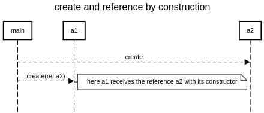

### how to create two actors a1 and a2 so that a1 has the reference of a2?

#### by construction

https://doc.akka.io/docs/akka/current/actors.html#creating-actors



```
title create and reference by construction

participant main
participant a1
participant a2

main-->a2:create
main-->a1:create(ref:a2)
space -4
note right of a1: here a1 receives the reference a2 with its constructor
```

https://sequencediagram.org/index.html#initialData=C4S2BsFMAIGMCdIENgyQOwCbUQM0ourDAEYCecA9ugM7DwCuso1AUKwA5Lyiwhfpg0ALZIQ6Tt178MQpAEZJPEHwFyATO1HiAtDoB8SdQC4EyVK23o9h+acQpIACjzGjASlY0uxaDoAsrOiUqDggAOYAFkKUuNAKxtCRBGjyOJDEIABukDTQwMnp+IS+RtAA7mCR0GB5sNR0jMyU8EA
