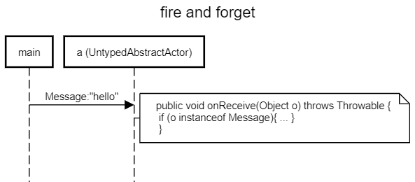

Fire and forget is also called tell

https://doc.akka.io/docs/akka/current/actors.html#send-messages

to receive a message here is the first way:

### UntypedAbstractActor

uses `public void onReceive(Object m) throws Throwable {` and `if (m instanceof Message)`



```
title fire and forget

main->a (UntypedAbstractActor):Message:"hello"
space -4
note right of a (UntypedAbstractActor): public void onReceive(Object o) throws Throwable { \n if (o instanceof Message){ ... } \n }
```

https://sequencediagram.org/index.html#initialData=C4S2BsFMAIDMQE4wIYDsAmcD2CDmlgAoQgW2RFQFoA+ZaACgFVVgBPAB0nQEEAjAZ2AJkAY2DcxOAJQAuALKR+-ZPhkAiABaRw4LGsL92omJQAshVFmAwEIXBuDQssaHSYsOXPoOFiJwaRlodgBXXnAQEWgANywQTCxUACVIEUgQaMh6AHleACtUxywpaGANBCwAd35oABVyquRwmABvaAAdVGgQF3osbtRBNDTnaAUlFUgpNoA6OegAXw6uhaA
