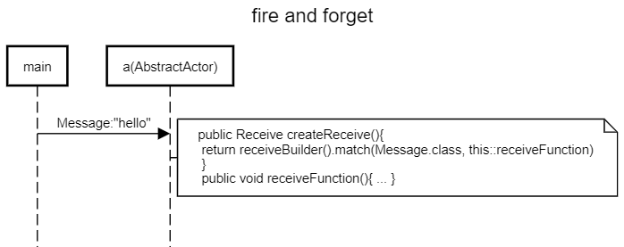

Fire and forget is also called tell

https://doc.akka.io/docs/akka/current/actors.html#send-messages

another way for received messages:

### AbstractActor

uses `public Receive createReceive() {` and `return receiveBuilder()
				.match(Send.class, this::receiveSend)`



```
title fire and forget

main->a(AbstractActor):Message:"hello"
space -4
note right of a(AbstractActor): public Receive createReceive(){ \n return receiveBuilder().match(Message.class, this::receiveFunction) \n } \n public void receiveFunction(){ ... }

```

https://sequencediagram.org/index.html#initialData=C4S2BsFMAIDMQE4wIYDsAmcD2CDmlgAoQgW2RFQFoA+ZACgEEAjAZ2AWQGNgHucBKAFwBZSCxbJ8ggEQALSOHBZphFgAcuMSgBZCqLMBgIQuWcGhZY0eszYduvYAMHQ1AVybgQnaACVInJAgAG4wnEjIhv6BIZB0-ADe0AA6qNBIwG4IaUgxoQBCbiDg6JAI8QB0ZMCcsnSi4pKQFZzgyOIANNDAsiAsgoK5QaEAYm6o3CBYqPwpaQC+c64eXj7BWCCYQ7FjE6DT8UkVx9DzhEA
