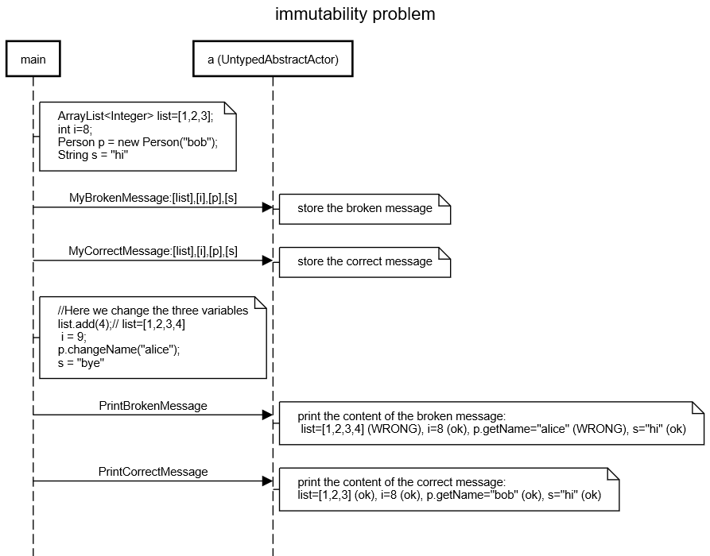

Be very careful with messages content, especially with objects: the immutability affects only the adress/reference of the object (indeed it is final) but not the content pointed at this adress (the content referenced by the object).

The solution is to clone objects deeply, but deep cloning is a very difficult task in Java. There is a simple way to do it if and only if the objects in the messages are Serializable. We can then use org.apache.commons.lang3.SerializationUtils.clone(object) to clone an object within an message. For this, you have to add a dependency to your pom.xml :

```
<dependency>
    <groupId>org.apache.commons</groupId>
    <artifactId>commons-lang3</artifactId>
    <version>3.9</version>
</dependency>
```
Careful, do not use the clone() method that exists by default in the Object class or ArrayList, because it doen't do deep cloning, especially for ArrayList it only clones the cell adresses but not the content... Look at this example to understand the problem:

***This is a very important problem to understand, please look very carefully!***



```
title immutability problem
note right of main:ArrayList<Integer> list=[1,2,3];\nint i=8;\nPerson p = new Person("bob");\nString s = "hi"
main->a (UntypedAbstractActor):MyBrokenMessage:[list],[i],[p],[s]
space -4
note right of a (UntypedAbstractActor):store the broken message
main->a (UntypedAbstractActor):MyCorrectMessage:[list],[i],[p],[s]
space -4
note right of a (UntypedAbstractActor):store the correct message
note right of main:\/\/Here we change the three variables\nlist.add(4);\/\/ list=[1,2,3,4]\n i = 9;\np.changeName("alice");\ns = "bye"
main->a (UntypedAbstractActor):PrintBrokenMessage
space -4
note right of a (UntypedAbstractActor):print the content of the broken message:\n list=[1,2,3,4] (WRONG), i=8 (ok), p.getName="alice" (WRONG), s="hi" (ok)
main->a (UntypedAbstractActor):PrintCorrectMessage
space -4
note right of a (UntypedAbstractActor):print the content of the correct message:\nlist=[1,2,3] (ok), i=8 (ok), p.getName="bob" (ok), s="hi" (ok)


```
https://sequencediagram.org/index.html#initialData=C4S2BsFMAIQWzgV2AQwEYnGAntADgE4D2aUcAUAHZHAwEgDmAFsNEQGbRwoiUBcAQQIEU2ADIgAzsAA8ASUq0GkAgD5oWaQF4A2gEYANACYDAZgC6AbgA6lXqxBaAHDcoAFFZKKV80LdEpIAHdoDwIvSgAKACI0EmiASlcAZWB6SgZoST9oaKYQaPJuXgBaVRRoSIBVRWw8SAATATRpEQBjYAEOogIEvgBZbAAhYgBrSEp+yElJFGU+HU1gcwMdEBWdPA3Jc3JJPBQ2mBKAFioaOkYWNk4K6tr6ppa0w87u3r5pHphgJhg0MYTLjTWbKIo8ShlO41YB1RrNVqvLrAHp9QYAYR6BEgHSmMzmkAWSw261WW1WOz2ByO0FO51o0HozFYHGg0Ie8Oe7TeKI+X2x0F+MDaWJxrDgIIJ9MuzJuXAhfGsAHplQAJFQwILCpgoDI-P6CpjYmAANxQ9HQUEktiWADoUA0GpETkllcqNFJgLpDCZTAYTuZbLAcgBOVx4W1tHV6gByKAlMRQWCOiVc2X8sWwkEKxUh5UqMLhT0RHWRqL4bnSwBGRHGk0lYP2h2OZ2oDKZ11Z7NhjwRL1L7z6hHshuF3loijlQugANrQIl+PmQaW3uMZn95kqAHUAEoAeRjAHEEgZYM5KrWT-hbcpgHGJVpokmQCnt-uj1fJI-8tEL6MEuCpT5vcPaciWPLlpW9iYsIYp4qCkBUs2tKthcjJXCytwFhyxb9hBHzDpO04iooEyYaO0AirBHTAouhI2p6q6+pukSXqejhOH+V4Rre96QI+cRoL+rH-qeX55AUXHkEAA