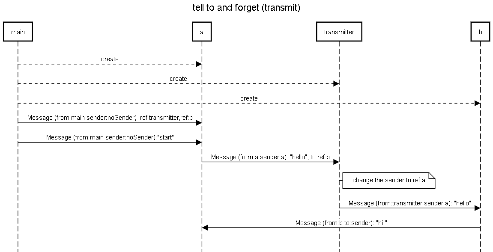

**tell** to is also called **transmit** or **forward**

you first have to code it yourself with a "transmitter" actor made by yourself and then use the forward pattern already existing in AKKA that uses a "mediator" actor (created by the system).

Be aware that the main function sends only two messages in the demo sequence below. That means there is NO MORE THAN 2 "tell" calls within the main function.
The other "tell" calls are within the actors "a", "transmitter" and "b".
Double check that the main function is calling "tell" a maximum of 2 times. If there is more "tell" calls, then they are in the wrong class and should be within some actor classes.
Also be aware that who is "really" sending the message and what is in the "sender" header of the message can be different.
For exemple, when the main is sending a message, it is sent by nobody and there is no sender in the header.
Then receiver can use the getSender() method to get the "sender" header that was put in the message (but not the real sender that really sent the message).
The sender can also use the getSelf() method to get its own reference.

https://doc.akka.io/docs/akka/current/actors.html#forward-message 



```
title tell to and forget (transmit)

main-->a:create
main-->transmitter:create
main-->b:create
main->a:Message (from:main sender:noSender) :ref:transmitter,ref:b
main->a:Message (from:main sender:noSender):"start"
a->transmitter:Message (from:a sender:a): "hello", to:ref:b
note right of transmitter:change the sender to ref:a
transmitter->b:Message (from:transmitter sender:a): "hello"
b->a:Message (from:b to:sender): "hi!"
```

https://sequencediagram.org/index.html#initialData=C4S2BsFMAJk9ywPbQIYDsAm0BmSBOA5pMNABTD4YDOAtmAJQBQTtqI6AtJwHyoBcAY3yRUcVuy69KNesDj4hIsZAkduPAEZLR4tur78AspGrVUxcjnxJa-femjVIWSIvRIAyi8xuG0fhEcfhl0OjAFABog-k01LkMTMwsYMmtbe0knHzd+D29XfAZ+ACJqYFR8YBKmVGkqMLkFY1NzSzSbO1Rswv5UYugSgAt4cCQSyORAyGC4jzhofBBCIdIkHFgG8PlcwSGMS2ARnt98ZEWZvqZQ7YVebSS21PS7G6a3E9z+-kGRhHGmJpeAJHikrJ1YlNnIUBsMQABCEpAA
