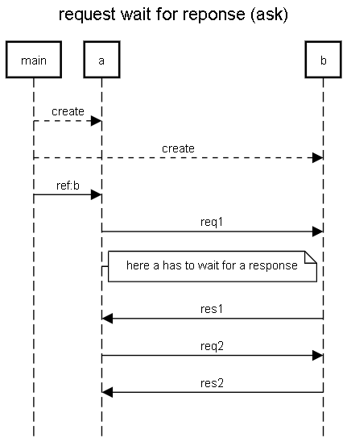

request response is also called ASK pattern in Akka 

this ask is waiting a future using the Await.result method.

This is a bad habbit because actors shouldn't block. Waiting in an actor is bad, so using Await is bad (and the ASK pattern is usually bad).

https://doc.akka.io/docs/akka/current/futures.html

more documentation: https://doc.akka.io/docs/akka/current/actors.html#ask-send-and-receive-future 


```
Timeout timeout = Timeout.create(Duration.ofSeconds(5));
Future<Object> future = Patterns.ask(b,new Request("req1"), timeout);
Responre res1 = (Response) Await.result(future, timeout.duration());
```

Be careful to distinguish between Java Futures and Akka Futures. Be careful when you import the class Futures! In java, you use Futures with a blocking get. You can't get the value without blocking:

```
future.get(1, TimeUnit.SECONDS);
```




```
title request wait for reponse (ask)

main-->a:create
main-->b:create
main->a:ref:b
a->b:req1
note right of a:here a has to wait for a response
b->a:res1
a->b:req2
b->a:res2

```

https://sequencediagram.org/index.html#initialData=C4S2BsFMAICdII4FdIGdjQO4EMzQGYD2sckADoQHaowAU2qA1gJQBQrAtrpQLQ8B82AFwBjeNmCRO3PvwBGo8ZOkhegofHxC5rbAIXwEARlaVCkuCADmACwyF80YTcjwn0Gw2jBCWXBiISbFJUCmopOQFheFQTPXkNRAAmVkj1GJSgA