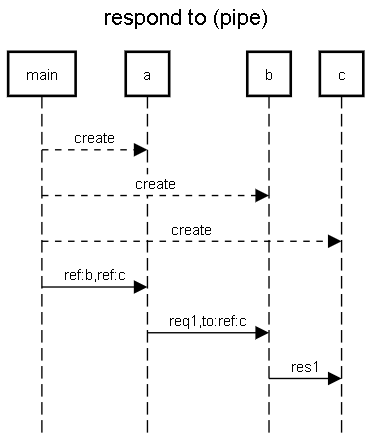

this one ressembles the tell to pattern

it is also called the pipe pattern

First, do it entirely with your implementation of simple actors.

OPTIONAL (and difficult): Then try to use the pipe pattern explained here https://doc.akka.io/docs/akka/2.5/futures.html#use-the-pipe-pattern 



```
title respond to (pipe)

main-->a:create
main-->b:create
main-->c:create
main->a:ref:b,ref:c
a->b:req1,to:ref:c
b->c:res1

```

https://sequencediagram.org/index.html#initialData=C4S2BsFMAICdIM4AcD2A7AJtYLoAokQlIBKAKDIFsBDENAWnoD5qAuAY3muEitoeYAjDlx586jJuxGRuvGhJat4AM1aCANKo5lqQ5ZACOARg04Da9mUHNp8BMbJA
