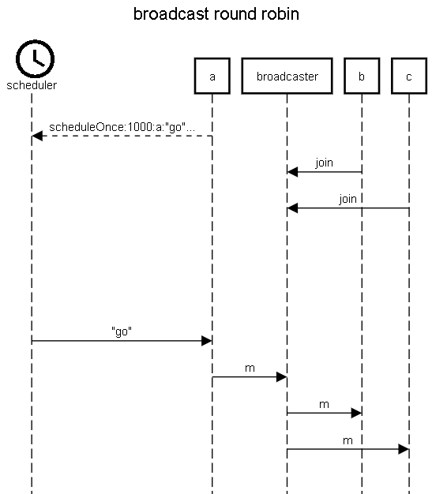

this pattern is also called router (but the broadcast is a simplied version of the router pattern)

You have to do it by yourself because the router pattern in Akka is quite complex.
Here is the documentation for the router pattern in Akka, only if you have time to try the router pattern officially implemented, do it, otherwise, continue with the following patterns.

Here we consider that the main function is creating all the actors and sending the broadcaster reference to all the other actors.

Also here we have to make sure the actor "a" is waiting for "b" and "c" to send the join message to the broadcaster. 
We consider that "b" and "c" will join in less than 1 second and therefore "a" will wait 1 second before sending the "m" message. This COULD BE done with Thread.sleep(1000) BUT IT'S REALLY BAD.
Indeed, remember that Thread.sleep(1000) is a really bad bad bad habbit ! You should never use Thread.sleep(1000) because it blocks the actor and blocking an actor is really bad !

Instead, "a" should ask a scheduler to send a message after 1 second. There is a simple scheduler actor (among more complex ones) in the akka system that already exists. You don't have to create it, use it directly. In order for "a" to ask the system scheduler to send a message after one second, you should use this method that will ask the scheduler actor to "program" a "delayed" message:

```
getContext().system().scheduler().scheduleOnce(Duration.ofMillis(1000), getSelf(), "go", getContext().system().dispatcher(), ActorRef.noSender());
```



```
title broadcast round robin

materialdesignicons F150 scheduler
participant a
participant broadcaster
participant b
participant c

a-->scheduler:scheduleOnce:1000:a:"go"...
b->broadcaster:join
c->broadcaster:join
space 6
scheduler->a:"go"
a->broadcaster:m
broadcaster->b:m
broadcaster->c:m

```

https://sequencediagram.org/index.html#initialData=C4S2BsFMAICMCcD2BDAJgY2QZ2NJBXAO1T0VhEIChKBbZYSeEZcVSLEAc0JHUUKzQAYgEYArAAZoWdAAtIqfFHiUADsnih0IdYVzI1GrTuR64SNJhyNDm3ibOxbx3bnTVkAWk8A+GfMVlAC5-BSVIAHlCdEggkQkEoOQggCJORBSAOmzKWF8EFAxsBngggCtECkp0fIsi61KKqqx1GOgANkpQwMZfZLSMyi8fAstixiCaXLqrEvzJ6cLZ3p90BaA
