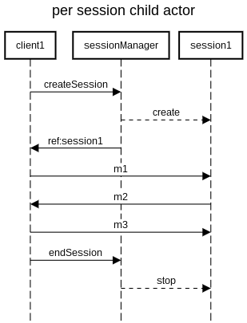

the idea is to create a child to manage a sesssion



```
title per session child actor

participant client1
participant sessionManager
participant session1

client1->sessionManager:createSession
sessionManager-->session1:create
sessionManager->client1:ref:session1
client1->session1:m1
session1->client1:m2
client1->session1:m3
client1->sessionManager:endSession
sessionManager-->session1:stop
```

http://sequencediagram.org/index.html#initialData=C4S2BsFMAIAdIE7QM6WckB7AdtAxgBYjgAm0AhnsJggFC2zkKh4iPbD7giQcCMDJizbkOKNBhwBZUeQDmiQcxCt2nVOizYBtPN17A+AWgB8GydhnZ5iAFx4EkcsEgBlCVtrmtVmwiOm3jh89o7OkF4e0rIK-iZ6PPy2jgBmtkHauvr8gVHatgC2AhnG8dmGhQBMWYmGuZrBhQDMNQalGb6xtrwk7g3Ykf2diAFmeSHI1LBAA

there is an implementation in akka:

https://doc.akka.io/docs/akka/current/typed/interaction-patterns.html#per-session-child-actor


