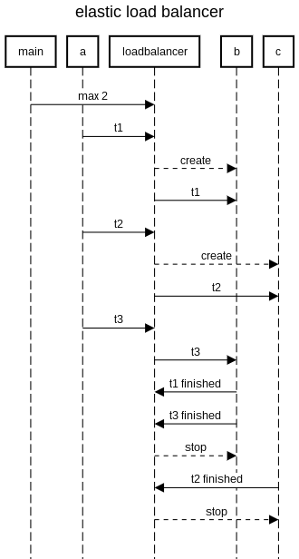

```
title elastic load balancer

participant main
participant a
participant loadbalancer
participant b
participant c

main->loadbalancer:max 2
a->loadbalancer:t1
loadbalancer-->b:create
loadbalancer->b:t1
a->loadbalancer:t2
loadbalancer-->c:create
loadbalancer->c:t2
a->loadbalancer:t3
loadbalancer->b:t3
b->loadbalancer:t1 finished
b->loadbalancer:t3 finished
loadbalancer-->b:stop
c->loadbalancer:t2 finished
loadbalancer-->c:stop
```

http://sequencediagram.org/index.html#initialData=C4S2BsFMAJPBDAzqAxtcB7eATaAjeBAOxUgCcAoCgB3jNRFqOGgFt4Qia6GmX5u9ECkbxm6LNgLFSlWkJF98g3mJYoq7TgFoAfJhzSxsgFzsAHtABMFeHoNTCx8ieABGCg6Mly2vXhMUMkh4YEhPSW9Zf1cPO31Ipx8yVxsvJOi9FEDg0PD0mV9dbOAbeILnFOAAZgjDDKKAmoo8e0TCqrdoADNOEEQAC0hsFrb6jtdqnr7B4brHDr9dAOQMagoUMYXK1OmifqGRiuSl7NXqIA
