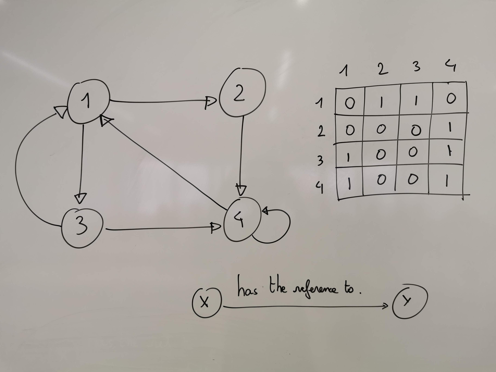

Starting with an adjacency matrix, the main creates a communication topology.
Following this topology, an actor can communicate only to its known actors.

* First create all actors
* Second, send the list of known actors to each actor

