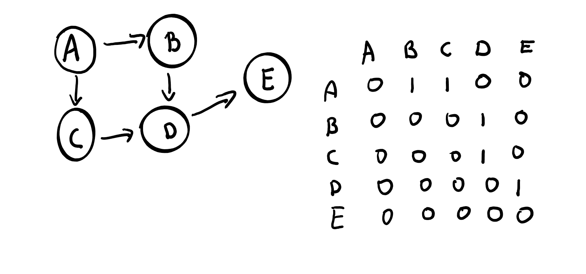
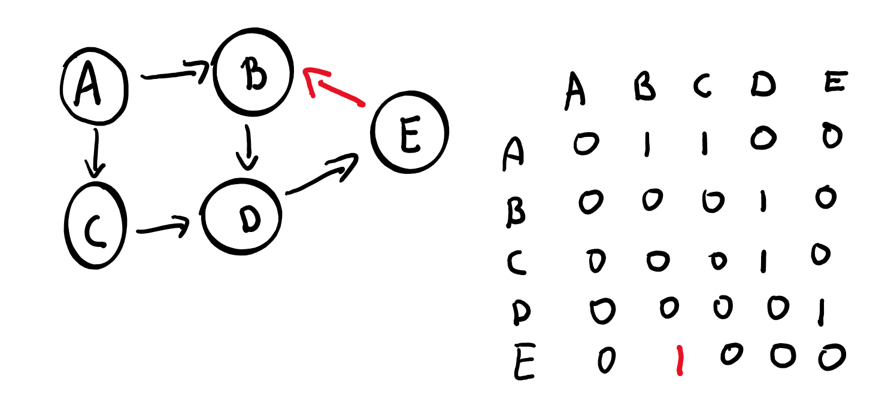

Create a communication topology from this adjacency matrix:

The arrows (like A -> B for example) mean that A has a reference to B (but B do not)

Then implement the most simple uncontrolled flooding algorithm possible.

The actor A will start the algorithm.

The flooding algorithm sends the same message through the topology to "flood" it: for example here A receives a message m, sends its to B and C. B sends m to D. C sends m to D. Because D received m 2 times (from B and C) it will send 2 times the message m to E. 

Then try this algorithm with this communication topology and show that there is a infinite cycle: 

